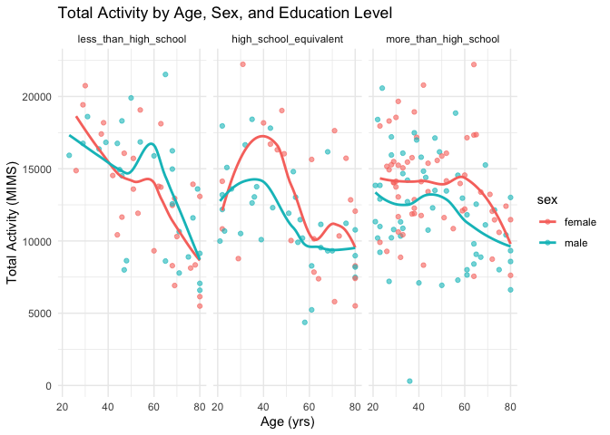

p8105_hw3_ms6826
================
2024-10-04

## Problem 1

``` r
data("ny_noaa")
```

Short description of the dataset, noting the size and structure of the
data, describing some key variables, and indicating the extent to which
missing data is an issue –This dataset is very large (over 2.5 million
observations) because it includes records from over 100,000 weather
stations (with separate observations for the same day from different
stations) and includes daily records of variables like total
precipitation, maximum and minimum temperatures, total snowfall, etc.
There is a lot of variability in the data, as about half of the stations
only report precipitation and each station covers varying periods of
time. Since we have so many observations for each day, I don’t think
missing data will be a huge issue once we can compile the observations
for each day.

Data Cleaning

``` r
ny_noaa_clean=
ny_noaa |> 
  separate(
    date, into = c("year", "month", "day"), sep = "-"
  ) |> 
  mutate(
    prcp= prcp/10
  ) |> 
  mutate(
    tmax= as.numeric(tmax, na.rm=TRUE),
    tmin= as.numeric(tmin, na.rm=TRUE)
  ) |> 
  mutate(
    tmax= tmax/10
  ) |> 
  mutate(tmin=tmin/10)
```

Comment–Separating date into 3 variables (year month day). Converting
prcp to units of mm so that snowfall, snow depth, and precipitation are
all in millimeters. Converting tmax and tmin to units of Celcius.

Making a two-panel plot

``` r
station_avgtmax=
ny_noaa_clean |> 
   filter(month %in% c("01", "07")) |> 
  group_by(id, year, month) |> 
  summarize(mean_tmax= mean(tmax, na.rm=TRUE)) |> 
  drop_na(mean_tmax)
```

    ## `summarise()` has grouped output by 'id', 'year'. You can override using the
    ## `.groups` argument.

``` r
ggplot_avgtmax=
  station_avgtmax |> 
 ggplot(aes(x=year, y=mean_tmax, group=id)) +
  geom_point()  +
  facet_grid(. ~ month)

ggplot_avgtmax
```

<!-- --> Is
there any observable / interpretable structure? Any outliers? –As
predicted, the mean max temperature for the stations in January (winter
weather) are on average ~25 degrees Celcius lower than the mean max
temperatures in July (summer weather). The graph also indicates that
there is more variation in temperature in January (points are more
spread out) compared to July. There are a few outliers for each month
that are below the general mean temperature for that year, and the most
significant outlier is for a station in July in the year 1988.

Make a two-panel plot showing (i) tmax vs tmin for the full dataset
(note that a scatterplot may not be the best option); and (ii) make a
plot showing the distribution of snowfall values greater than 0 and less
than 100 separately by year.

``` r
station_tmax_tmin=
  ny_noaa_clean |> 
  drop_na(tmax) |> 
  drop_na(tmin)

ggp_tmax_tmin=
station_tmax_tmin |> 
  ggplot(aes(x=tmin, y=tmax)) +
  geom_hex()

station_snow=
  ny_noaa_clean |> 
  filter(snow>0, snow<100)

ggp_snow=
  station_snow |> 
  ggplot(aes(x=snow, y=as.factor(year))) +
  geom_density_ridges()

(ggp_tmax_tmin + ggp_snow)
```

    ## Picking joint bandwidth of 3.76

<!-- -->

## Problem 2

Load, tidy, merge, and otherwise organize the data sets

``` r
covar_df=
  read_csv("data/nhanes_covar.csv", skip=4, na= c("NA")) |> 
  janitor::clean_names() |> 
  mutate(
    sex= case_match(
      sex,
      1 ~ "male",
      2 ~ "female"
    )) |> 
  mutate(
    education=case_match(
      education,
      1 ~ "less_than_high_school",
      2 ~ "high_school_equivalent",
      3 ~ "more_than_high_school"
    )
  )
```

    ## Rows: 250 Columns: 5
    ## ── Column specification ────────────────────────────────────────────────────────
    ## Delimiter: ","
    ## dbl (5): SEQN, sex, age, BMI, education
    ## 
    ## ℹ Use `spec()` to retrieve the full column specification for this data.
    ## ℹ Specify the column types or set `show_col_types = FALSE` to quiet this message.

``` r
accel_df=
  read_csv("data/nhanes_accel.csv") |> 
  janitor::clean_names()
```

    ## Rows: 250 Columns: 1441
    ## ── Column specification ────────────────────────────────────────────────────────
    ## Delimiter: ","
    ## dbl (1441): SEQN, min1, min2, min3, min4, min5, min6, min7, min8, min9, min1...
    ## 
    ## ℹ Use `spec()` to retrieve the full column specification for this data.
    ## ℹ Specify the column types or set `show_col_types = FALSE` to quiet this message.

``` r
merge_df=
  full_join(covar_df, accel_df, by= "seqn")

mims_df=
  merge_df |> 
  filter(age>=21) |> 
  mutate(education= factor(education, levels= c("less_than_high_school", "high_school_equivalent", "more_than_high_school" ) )) |> 
  drop_na(bmi, education)
```

Produce a reader-friendly table for the number of men and women in each
education category, and create a visualization of the age distributions
for men and women in each education category.

``` r
mims_df |> 
  group_by(sex, education) |> 
  summarize(
    n_obs=n()
  ) |> 
  knitr::kable()
```

    ## `summarise()` has grouped output by 'sex'. You can override using the `.groups`
    ## argument.

| sex    | education              | n_obs |
|:-------|:-----------------------|------:|
| female | less_than_high_school  |    28 |
| female | high_school_equivalent |    23 |
| female | more_than_high_school  |    59 |
| male   | less_than_high_school  |    27 |
| male   | high_school_equivalent |    35 |
| male   | more_than_high_school  |    56 |

``` r
ggp_age=
  mims_df |> 
  ggplot(aes(x=education, y=age, fill=sex)) +
  geom_boxplot() +
   labs(title = "Age Distribution by Education Level and Sex",
       x = "Education Level",
       y = "Age") +
  theme_minimal()
```

Comment —The reader friendly table tells us that most of the men and
women have an education level greater than high school. The lowest
frequency of education level for both men and women is “less than high
school equivalent”. The graph tells us that the median age (for both men
and women) for those with above high school education is lower (~45
years) than the median age for education levels at or below high school.

Using your tidied dataset, aggregate across minutes to create a total
activity variable for each participant. Plot these total activities
(y-axis) against age (x-axis); your plot should compare men to women and
have separate panels for each education level. Include a trend line or a
smooth to illustrate differences.

``` r
mims_ag_df=
  mims_df |>
  mutate(total_activity=rowSums(across(c(min1:min1440)))) |> 
  select(seqn, sex, age, bmi, education, total_activity, everything())

ggplot_activity=
  mims_ag_df |> 
  ggplot(aes(x=age, y=total_activity, color=sex))+
  geom_point(alpha=.6) +
  geom_smooth(se= FALSE) +
  facet_grid(. ~ education) +
  labs(title = "Total Activity by Age, Sex, and Education Level",
       x = "Age (yrs)",
       y = "Total Activity (MIMS)") +
  theme_minimal()

ggplot_activity
```

    ## `geom_smooth()` using method = 'loess' and formula = 'y ~ x'

<!-- -->
Comment —As expected, total activity is generally highest for younger
ages and lowest for older ages. The smooth lines indicate that females
with education high school equivalent or more than high school generally
have higher total activity than males.

Make a three-panel plot that shows the 24-hour activity time courses for
each education level and use color to indicate sex.

``` r
mims_activity_df=
  mims_df |> 
  pivot_longer(
    min1:min1440,
    names_to = "minute",
    names_prefix= "min",
    values_to= "activity" ) |> 
  mutate(minute= as.numeric(minute)) 

ggplot_activity=
  mims_activity_df |> 
  ggplot(aes(x=minute, y=activity, color=sex, group=seqn)) +
  geom_line(alpha=.1) +
  geom_smooth(aes(group=sex), se= FALSE)+
  facet_wrap(.~ education) +
  labs(title = "24-Hour Activity by Education Level and Sex",
       x = "Time (hour)",
       y = "Activity Level (MIMS)") +
  scale_x_continuous(breaks = seq(0, 1440, by = 240), labels = c("00:00", "04:00", "08:00", "12:00", "16:00", "20:00", "24:00")) +
  theme_minimal() +
  theme(legend.position = "top")

ggplot_activity
```

    ## `geom_smooth()` using method = 'gam' and formula = 'y ~ s(x, bs = "cs")'

<!-- -->
Describe in words any patterns or conclusions you can make based on this
graph; including smooth trends may help identify differences. –Activity
level during daylight hours seems to be slightly higher among people
with more than a high school education compared to people with high
school equivalent or less than. Additionally, it seems like there are no
major differences between male and female activity levels for any
education level, except with females being slightly more active than
males for those who have higher than high school-level education.

## Problem 3

Import, clean, and tidy citibike data.

``` r
july20_df=
  read_csv("data/July 2020 Citi.csv") |> 
  janitor::clean_names() |> 
  mutate(
    year= "2020",
    month= "july"
  )
```

    ## Rows: 21048 Columns: 7
    ## ── Column specification ────────────────────────────────────────────────────────
    ## Delimiter: ","
    ## chr (6): ride_id, rideable_type, weekdays, start_station_name, end_station_n...
    ## dbl (1): duration
    ## 
    ## ℹ Use `spec()` to retrieve the full column specification for this data.
    ## ℹ Specify the column types or set `show_col_types = FALSE` to quiet this message.

``` r
july24_df=
  read_csv("data/July 2024 Citi.csv") |> 
  janitor::clean_names() |> 
  mutate(
    year= "2024",
    month= "july"
  )
```

    ## Rows: 47156 Columns: 7
    ## ── Column specification ────────────────────────────────────────────────────────
    ## Delimiter: ","
    ## chr (6): ride_id, rideable_type, weekdays, start_station_name, end_station_n...
    ## dbl (1): duration
    ## 
    ## ℹ Use `spec()` to retrieve the full column specification for this data.
    ## ℹ Specify the column types or set `show_col_types = FALSE` to quiet this message.

``` r
jan20_df=
  read_csv("data/Jan 2020 Citi.csv") |> 
  janitor::clean_names() |> 
  mutate(
    year= "2020",
    month= "jan"
  )
```

    ## Rows: 12420 Columns: 7
    ## ── Column specification ────────────────────────────────────────────────────────
    ## Delimiter: ","
    ## chr (6): ride_id, rideable_type, weekdays, start_station_name, end_station_n...
    ## dbl (1): duration
    ## 
    ## ℹ Use `spec()` to retrieve the full column specification for this data.
    ## ℹ Specify the column types or set `show_col_types = FALSE` to quiet this message.

``` r
jan24_df=
  read_csv("data/Jan 2024 Citi.csv") |> 
  janitor::clean_names() |> 
  mutate(
    year= "2024",
    month="jan"
  )
```

    ## Rows: 18861 Columns: 7
    ## ── Column specification ────────────────────────────────────────────────────────
    ## Delimiter: ","
    ## chr (6): ride_id, rideable_type, weekdays, start_station_name, end_station_n...
    ## dbl (1): duration
    ## 
    ## ℹ Use `spec()` to retrieve the full column specification for this data.
    ## ℹ Specify the column types or set `show_col_types = FALSE` to quiet this message.

``` r
july_df= bind_rows(july20_df, july24_df)

jan_df=bind_rows(jan20_df, jan24_df)

bike_df= bind_rows(july_df, jan_df)
```

Describe the resulting dataset. –The combined dataset of the 1% of
citibike rides \<4 hours from July2020, July2024, Jan2020, and Jan2024
includes two new rows that indicate the “month” and “year” the ride
comes from.

Reader-friendly table

``` r
bike_df |> 
  group_by(year, month, member_casual) |> 
  summarize(
    n_obs=n(),
  ) |> 
  knitr::kable()
```

    ## `summarise()` has grouped output by 'year', 'month'. You can override using the
    ## `.groups` argument.

| year | month | member_casual | n_obs |
|:-----|:------|:--------------|------:|
| 2020 | jan   | casual        |   984 |
| 2020 | jan   | member        | 11436 |
| 2020 | july  | casual        |  5637 |
| 2020 | july  | member        | 15411 |
| 2024 | jan   | casual        |  2108 |
| 2024 | jan   | member        | 16753 |
| 2024 | july  | casual        | 10894 |
| 2024 | july  | member        | 36262 |

INSERT COMMENT

Make a table showing the 5 most popular starting stations for July 2024;
include the number of rides originating from these stations.

``` r
bike_df |> 
  filter(month== "july", year== "2024") |> 
  group_by(start_station_name) |> 
  summarise(
    n_obs=n(),
    ) |> 
  arrange(desc(n_obs)) |> 
  slice_head(n = 5) |>
  knitr::kable()
```

| start_station_name       | n_obs |
|:-------------------------|------:|
| Pier 61 at Chelsea Piers |   163 |
| University Pl & E 14 St  |   155 |
| W 21 St & 6 Ave          |   152 |
| West St & Chambers St    |   150 |
| W 31 St & 7 Ave          |   146 |
